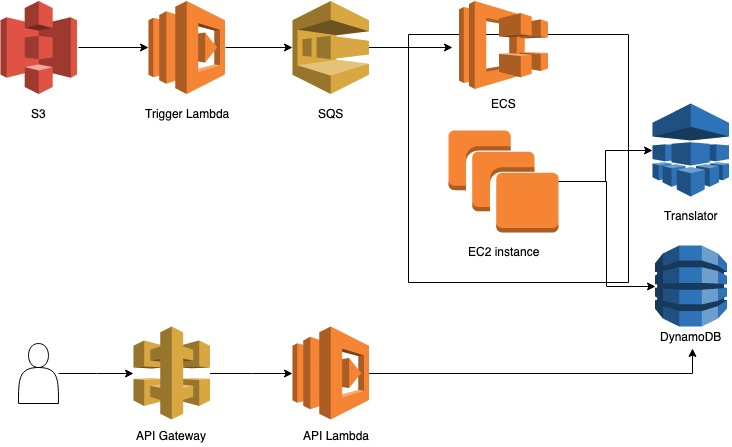

# serverless-comprehend

## 환경 구성

- [serverless framework](./etc/serverless.md)
- [aws cli](./etc/aws-cli.md)

## 구성

- [ ] [step1](./step1.md) aws, serverless framework
- [ ] step2 step functions, translator lambda 구성
- [ ] step3 dynamodb 구성
- [ ] step4 api gateway, api lambda 구성

## Reference

- [AWSKRUG Data Analysis Hands-On](https://github.com/datamaker/lambda-refarch-imagerecognition/tree/master/Workshop-Korean)
- [serverless example](https://github.com/serverless/examples)
